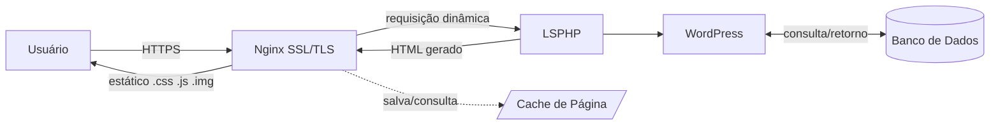

## Relação entre Nginx e LiteSpeed/LSPHP

Nessa arquitetura, o Nginx e o LiteSpeed trabalham juntos, mas cada um tem uma responsabilidade diferente.

O Nginx fica na camada de entrada da aplicação. Ele recebe as requisições dos usuários, faz o gerenciamento de conexões HTTPS, entrega arquivos estáticos como imagens, CSS e JavaScript e encaminha para o PHP apenas aquilo que precisa ser processado dinamicamente.

Já o LSPHP (LiteSpeed PHP) é o responsável por executar o código PHP do WordPress. Quando o Nginx recebe uma requisição para uma página dinâmica, ele repassa essa requisição para o LSPHP, que processa o WordPress, consulta o banco de dados quando necessário e gera o HTML que será retornado ao usuário.

### Fluxo simplificado

